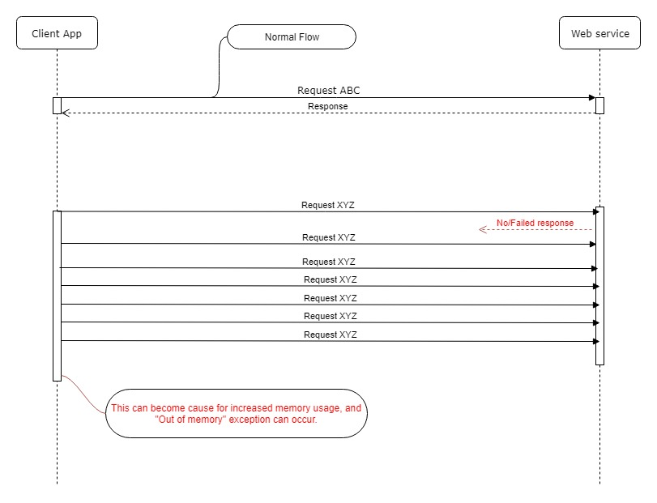
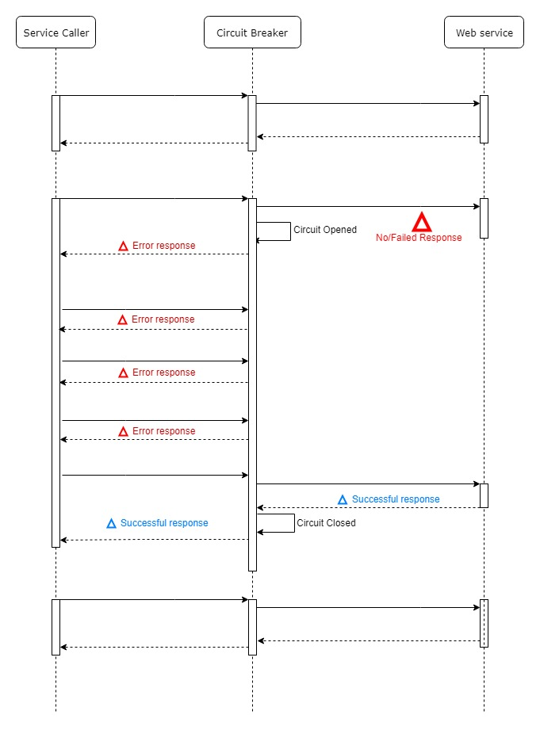

## What is "Circuit Breaker"

Circuit breaker is a design pattern to gracefully degrade functionality when a method network call fails. 

## Why?

Circuit breaker restricts an app to crash because of failed network call and prevents the failure from cascade.

## Solution

## Example

This example uses Spring Cloud Netflix Hystrix to apply circuit breakers to potentially failing method calls by using the Netflix Hystrix fault tolerance library. For detail check the following link;

https://github.com/spring-guides/gs-circuit-breaker